# TaskMaster CMMS - System Architecture

## Overview

TaskMaster is a next-generation Computerized Maintenance Management System (CMMS) built with a TypeScript full-stack architecture. This document defines the core architecture, domain models, and technical decisions.

### Tech Stack Summary

| Layer | Technology | Version |
|-------|------------|---------|
| **Database** | PostgreSQL | 17 |
| **Cache/Queue** | Redis | 8 |
| **Backend Runtime** | Node.js | 22 LTS |
| **Backend Framework** | NestJS | 11 |
| **ORM** | Prisma | 7 |
| **API Documentation** | OpenAPI/Swagger | 3.1 |
| **Background Jobs** | BullMQ | 5.x |
| **Frontend Framework** | React | 19 |
| **Build Tool** | Vite | 7 |
| **CSS Framework** | Tailwind CSS | 4 |
| **State Management** | TanStack Query + Zustand | 5.x |
| **Offline Storage** | Dexie.js | 4.x |
| **PWA Toolkit** | Workbox | 7.x |
| **Reverse Proxy** | nginx | alpine |

### Architecture Principles

1. **Multi-tenant from day one**: Row-level tenant isolation with `tenant_id` on all business entities
2. **Offline-first**: PWA with local persistence and robust sync
3. **Modular monolith**: Single deployable unit with clear domain boundaries
4. **Event-driven internals**: Redis Streams for async operations
5. **Audit everything**: Immutable audit log for all write operations

---

## Domain Model

### Core Entities

```
┌─────────────────────────────────────────────────────────────────────────────┐
│                              TENANT BOUNDARY                                │
├─────────────────────────────────────────────────────────────────────────────┤
│                                                                             │
│  ┌──────────┐       ┌──────────────┐       ┌─────────────┐                 │
│  │  Tenant  │───────│     User     │───────│    Role     │                 │
│  └──────────┘       └──────────────┘       └─────────────┘                 │
│       │                    │                      │                         │
│       │                    │                      │                         │
│       ▼                    ▼                      ▼                         │
│  ┌──────────┐       ┌──────────────┐       ┌─────────────┐                 │
│  │ Location │◄──────│  Work Order  │───────│ Permission  │                 │
│  └──────────┘       └──────────────┘       └─────────────┘                 │
│       │                    │                                                │
│       │                    ├───────────────┐                               │
│       ▼                    ▼               ▼                               │
│  ┌──────────┐       ┌──────────────┐ ┌───────────┐                        │
│  │  Asset   │◄──────│   WO Step    │ │ WO Comment│                        │
│  └──────────┘       └──────────────┘ └───────────┘                        │
│       │                    │                                                │
│       │                    │                                                │
│       ▼                    ▼                                                │
│  ┌──────────┐       ┌──────────────┐       ┌─────────────┐                 │
│  │Inventory │       │  Attachment  │       │  Schedule   │                 │
│  │   Item   │       └──────────────┘       └─────────────┘                 │
│  └──────────┘                                     │                         │
│       │                                           │                         │
│       ▼                                           ▼                         │
│  ┌──────────┐                             ┌─────────────┐                  │
│  │Inventory │                             │  Generated  │                  │
│  │   Txn    │                             │  Work Order │                  │
│  └──────────┘                             └─────────────┘                  │
│                                                                             │
└─────────────────────────────────────────────────────────────────────────────┘
```

---

## Entity-Relationship Diagram

```mermaid
erDiagram
    %% ===== TENANT & AUTH =====
    Tenant {
        uuid id PK
        string name
        string slug UK
        string settings "JSONB"
        boolean is_active
        timestamp created_at
        timestamp updated_at
    }

    User {
        uuid id PK
        uuid tenant_id FK
        string email UK
        string password_hash
        string first_name
        string last_name
        string phone
        string avatar_url
        boolean is_active
        timestamp last_login_at
        timestamp created_at
        timestamp updated_at
    }

    Role {
        uuid id PK
        uuid tenant_id FK
        string name
        string description
        boolean is_system "Cannot be deleted"
        timestamp created_at
        timestamp updated_at
    }

    Permission {
        uuid id PK
        string resource "work_orders, assets, etc"
        string action "create, read, update, delete"
        string description
    }

    UserRole {
        uuid user_id FK
        uuid role_id FK
    }

    RolePermission {
        uuid role_id FK
        uuid permission_id FK
    }

    RefreshToken {
        uuid id PK
        uuid user_id FK
        string token_hash UK
        string device_info
        timestamp expires_at
        timestamp created_at
    }

    %% ===== LOCATIONS =====
    Location {
        uuid id PK
        uuid tenant_id FK
        uuid parent_id FK "Self-referential"
        string name
        string code UK
        string type "site, building, floor, area"
        string address
        decimal latitude
        decimal longitude
        string metadata "JSONB"
        boolean is_active
        timestamp created_at
        timestamp updated_at
    }

    %% ===== ASSETS & INVENTORY =====
    Asset {
        uuid id PK
        uuid tenant_id FK
        uuid location_id FK
        uuid parent_asset_id FK "Future: component hierarchy"
        string name
        string asset_tag UK
        string serial_number
        string manufacturer
        string model
        string category
        string status "operational, maintenance, retired"
        date purchase_date
        date warranty_expires
        string specifications "JSONB"
        timestamp created_at
        timestamp updated_at
    }

    InventoryItem {
        uuid id PK
        uuid tenant_id FK
        string name
        string sku UK
        string description
        string category
        string unit_of_measure
        decimal unit_cost
        integer reorder_point
        integer reorder_quantity
        string metadata "JSONB"
        boolean is_active
        timestamp created_at
        timestamp updated_at
    }

    InventoryStock {
        uuid id PK
        uuid tenant_id FK
        uuid item_id FK
        uuid location_id FK
        integer quantity_on_hand
        integer quantity_reserved
        timestamp last_counted_at
        timestamp created_at
        timestamp updated_at
    }

    InventoryTransaction {
        uuid id PK
        uuid tenant_id FK
        uuid item_id FK
        uuid from_location_id FK
        uuid to_location_id FK
        uuid work_order_id FK "Optional reference"
        uuid user_id FK
        string type "receive, issue, transfer, adjust, count"
        integer quantity
        string reason
        string reference_number
        timestamp created_at
    }

    %% ===== WORK ORDERS =====
    WorkOrder {
        uuid id PK
        uuid tenant_id FK
        string work_order_number UK
        uuid asset_id FK
        uuid location_id FK
        uuid created_by_id FK
        uuid assigned_to_id FK
        string title
        string description
        string type "reactive, preventive, predictive"
        string priority "low, medium, high, critical"
        string status "open, in_progress, on_hold, completed, cancelled"
        timestamp due_date
        timestamp started_at
        timestamp completed_at
        integer estimated_hours
        integer actual_hours
        string completion_notes
        integer version "Optimistic locking"
        timestamp created_at
        timestamp updated_at
    }

    WorkOrderStep {
        uuid id PK
        uuid tenant_id FK
        uuid work_order_id FK
        integer step_order
        string title
        string description
        boolean is_required
        boolean is_completed
        uuid completed_by_id FK
        timestamp completed_at
        string completion_notes
        timestamp created_at
        timestamp updated_at
    }

    WorkOrderComment {
        uuid id PK
        uuid tenant_id FK
        uuid work_order_id FK
        uuid user_id FK
        uuid parent_comment_id FK "Threading support"
        string content
        boolean is_internal "Not visible to requesters"
        timestamp created_at
        timestamp updated_at
    }

    WorkOrderSignature {
        uuid id PK
        uuid tenant_id FK
        uuid work_order_id FK
        uuid user_id FK
        string signature_data "Base64 or storage reference"
        string type "technician, supervisor, customer"
        timestamp signed_at
    }

    WorkOrderInventory {
        uuid id PK
        uuid work_order_id FK
        uuid inventory_item_id FK
        integer quantity_planned
        integer quantity_used
        timestamp created_at
    }

    %% ===== SCHEDULING =====
    Schedule {
        uuid id PK
        uuid tenant_id FK
        uuid asset_id FK
        uuid location_id FK
        uuid template_work_order_id FK "Template to clone"
        string name
        string description
        string recurrence_rule "RRULE format"
        date start_date
        date end_date
        integer lead_time_days
        uuid assign_to_id FK
        boolean is_active
        timestamp last_generated_at
        timestamp next_generation_at
        timestamp created_at
        timestamp updated_at
    }

    %% ===== ATTACHMENTS =====
    Attachment {
        uuid id PK
        uuid tenant_id FK
        string entity_type "work_order, asset, etc"
        uuid entity_id
        uuid uploaded_by_id FK
        string file_name
        string file_type
        integer file_size
        string storage_path
        string thumbnail_path
        string checksum
        timestamp created_at
    }

    %% ===== NOTIFICATIONS =====
    Notification {
        uuid id PK
        uuid tenant_id FK
        uuid user_id FK
        string type "work_order_assigned, schedule_due, etc"
        string title
        string body
        string data "JSONB - entity references"
        boolean is_read
        timestamp read_at
        timestamp created_at
    }

    NotificationPreference {
        uuid id PK
        uuid user_id FK
        string notification_type
        boolean email_enabled
        boolean push_enabled
        boolean in_app_enabled
        timestamp created_at
        timestamp updated_at
    }

    %% ===== AUDIT LOG =====
    AuditLog {
        uuid id PK
        uuid tenant_id FK
        uuid user_id FK
        string entity_type
        uuid entity_id
        string action "create, update, delete"
        string changes "JSONB - before/after"
        string ip_address
        string user_agent
        timestamp created_at
    }

    %% ===== RELATIONSHIPS =====
    Tenant ||--o{ User : "has"
    Tenant ||--o{ Role : "has"
    Tenant ||--o{ Location : "has"
    Tenant ||--o{ Asset : "has"
    Tenant ||--o{ InventoryItem : "has"
    Tenant ||--o{ WorkOrder : "has"
    Tenant ||--o{ Schedule : "has"

    User ||--o{ UserRole : "has"
    Role ||--o{ UserRole : "assigned to"
    Role ||--o{ RolePermission : "has"
    Permission ||--o{ RolePermission : "granted by"
    User ||--o{ RefreshToken : "has"

    Location ||--o{ Location : "parent of"
    Location ||--o{ Asset : "contains"
    Location ||--o{ InventoryStock : "stores"

    Asset ||--o{ Asset : "parent of"
    Asset ||--o{ WorkOrder : "subject of"

    InventoryItem ||--o{ InventoryStock : "stocked at"
    InventoryItem ||--o{ InventoryTransaction : "tracked by"
    InventoryItem ||--o{ WorkOrderInventory : "used in"

    WorkOrder ||--o{ WorkOrderStep : "contains"
    WorkOrder ||--o{ WorkOrderComment : "has"
    WorkOrder ||--o{ WorkOrderSignature : "signed with"
    WorkOrder ||--o{ WorkOrderInventory : "uses"
    WorkOrder ||--o{ Attachment : "has"
    WorkOrder }|--|| User : "created by"
    WorkOrder }o--o| User : "assigned to"

    Schedule ||--o{ WorkOrder : "generates"

    User ||--o{ Notification : "receives"
    User ||--o{ NotificationPreference : "configures"
    User ||--o{ AuditLog : "performs"
```



---

## Multi-Tenancy Strategy

### Approach: Row-Level Isolation with `tenant_id`

Every business entity table includes a `tenant_id` column that references the `Tenant` table. This approach was chosen over schema-per-tenant for:

1. **Simpler operations**: Single schema to migrate, backup, and maintain
2. **Connection efficiency**: Single connection pool shared across tenants
3. **Query simplicity**: Standard WHERE clauses vs. dynamic schema switching
4. **Cost efficiency**: No per-tenant database overhead

### Implementation

#### 1. Prisma Schema Pattern

```prisma
model WorkOrder {
  id        String   @id @default(uuid())
  tenantId  String   @map("tenant_id")
  tenant    Tenant   @relation(fields: [tenantId], references: [id])
  // ... other fields

  @@index([tenantId])
  @@map("work_orders")
}
```

#### 2. Tenant Context Middleware

```typescript
// Extracted from JWT and attached to every request
interface TenantContext {
  tenantId: string;
  userId: string;
  permissions: string[];
}

// NestJS middleware sets this on every request
@Injectable()
export class TenantMiddleware implements NestMiddleware {
  use(req: Request, res: Response, next: NextFunction) {
    const token = extractToken(req);
    const payload = verifyToken(token);
    req.tenantContext = {
      tenantId: payload.tenantId,
      userId: payload.userId,
      permissions: payload.permissions,
    };
    next();
  }
}
```

#### 3. Repository Pattern with Tenant Scoping

```typescript
@Injectable()
export class WorkOrderRepository {
  constructor(private prisma: PrismaService) {}

  async findAll(ctx: TenantContext, filters: WorkOrderFilters) {
    return this.prisma.workOrder.findMany({
      where: {
        tenantId: ctx.tenantId, // Always scoped
        ...filters,
      },
    });
  }
}
```

#### 4. Prisma Client Extension (Global Enforcement)

```typescript
// Ensures tenant_id is ALWAYS applied - defense in depth
const prismaWithTenant = prisma.$extends({
  query: {
    $allOperations({ args, query, operation, model }) {
      if (['Tenant', 'Permission'].includes(model)) {
        return query(args); // Skip for non-tenant tables
      }

      const tenantId = getTenantFromContext();
      if (!tenantId) throw new Error('Tenant context required');

      // Inject tenant filter
      args.where = { ...args.where, tenantId };
      return query(args);
    },
  },
});
```

#### 5. Database-Level RLS (Additional Layer)

```sql
-- PostgreSQL Row-Level Security as defense in depth
ALTER TABLE work_orders ENABLE ROW LEVEL SECURITY;

CREATE POLICY tenant_isolation ON work_orders
  USING (tenant_id = current_setting('app.current_tenant_id')::uuid);

-- Set in transaction before queries
SET LOCAL app.current_tenant_id = 'tenant-uuid-here';
```

### Tenant Isolation Checklist

| Layer | Mechanism | Purpose |
|-------|-----------|---------|
| JWT | `tenant_id` claim | Request-level context |
| Middleware | TenantContext injection | Application-level scoping |
| Repository | Explicit `tenantId` in queries | Code-level enforcement |
| Prisma Extension | Automatic injection | Defense in depth |
| PostgreSQL RLS | Policy-based filtering | Database-level enforcement |

---

## RBAC Design

### Permission Model

Permissions follow the pattern: `resource:action`

```typescript
// Example permissions
const PERMISSIONS = {
  // Work Orders
  'work_orders:create',
  'work_orders:read',
  'work_orders:read_all',    // See all WOs vs only assigned
  'work_orders:update',
  'work_orders:delete',
  'work_orders:assign',

  // Assets
  'assets:create',
  'assets:read',
  'assets:update',
  'assets:delete',

  // Inventory
  'inventory:read',
  'inventory:adjust',
  'inventory:transfer',

  // Admin
  'users:manage',
  'roles:manage',
  'settings:manage',
} as const;
```

### Default Roles

| Role | Description | Key Permissions |
|------|-------------|-----------------|
| **Admin** | Full system access | All permissions |
| **Supervisor** | Manage team and work orders | `work_orders:*`, `assets:read`, `users:read` |
| **Technician** | Execute assigned work | `work_orders:read`, `work_orders:update` (assigned only) |
| **Requester** | Submit and track requests | `work_orders:create`, `work_orders:read` (own only) |
| **Viewer** | Read-only access | `*:read` |

### Permission Checking

```typescript
@Injectable()
export class PermissionGuard implements CanActivate {
  canActivate(context: ExecutionContext): boolean {
    const requiredPermissions = this.reflector.get<string[]>(
      'permissions',
      context.getHandler(),
    );

    const { permissions } = context.switchToHttp()
      .getRequest().tenantContext;

    return requiredPermissions.every(p => permissions.includes(p));
  }
}

// Usage
@Post()
@Permissions('work_orders:create')
async createWorkOrder(@Body() dto: CreateWorkOrderDto) {
  // ...
}
```

---

## Audit Logging

### Design Principles

1. **Immutable**: Audit logs are append-only, never updated or deleted
2. **Comprehensive**: Every create, update, delete is logged
3. **Contextual**: Who, what, when, and from where
4. **Queryable**: Structured JSON for flexible querying

### Audit Log Schema

```typescript
interface AuditLogEntry {
  id: string;
  tenantId: string;
  userId: string;
  entityType: string;      // 'work_order', 'asset', etc.
  entityId: string;
  action: 'create' | 'update' | 'delete';
  changes: {
    before?: Record<string, unknown>;  // Previous state (update/delete)
    after?: Record<string, unknown>;   // New state (create/update)
    diff?: Array<{                     // Changed fields (update)
      field: string;
      from: unknown;
      to: unknown;
    }>;
  };
  metadata: {
    ipAddress: string;
    userAgent: string;
    requestId: string;
  };
  createdAt: Date;
}
```

### Implementation via Prisma Middleware

```typescript
prisma.$use(async (params, next) => {
  const result = await next(params);

  if (['create', 'update', 'delete'].includes(params.action)) {
    await auditService.log({
      entityType: params.model,
      entityId: result.id,
      action: params.action,
      changes: computeChanges(params),
      // ... context from AsyncLocalStorage
    });
  }

  return result;
});
```

---

## Data Integrity & Transactions

### Atomic Operations

All multi-step operations use Prisma's interactive transactions:

```typescript
// Example: Complete work order with inventory deduction
async completeWorkOrder(id: string, dto: CompleteWorkOrderDto) {
  return this.prisma.$transaction(async (tx) => {
    // 1. Update work order status
    const workOrder = await tx.workOrder.update({
      where: { id },
      data: {
        status: 'completed',
        completedAt: new Date(),
        completionNotes: dto.notes,
        version: { increment: 1 },
      },
    });

    // 2. Deduct inventory items used
    for (const item of dto.itemsUsed) {
      await tx.inventoryStock.update({
        where: { id: item.stockId },
        data: { quantityOnHand: { decrement: item.quantity } },
      });

      await tx.inventoryTransaction.create({
        data: {
          itemId: item.itemId,
          workOrderId: id,
          type: 'issue',
          quantity: -item.quantity,
          // ...
        },
      });
    }

    // 3. Create completion signature if required
    if (dto.signature) {
      await tx.workOrderSignature.create({
        data: {
          workOrderId: id,
          signatureData: dto.signature,
          type: 'technician',
          // ...
        },
      });
    }

    return workOrder;
  });
}
```

### Optimistic Locking

Work orders and other frequently-edited entities use version-based optimistic locking:

```typescript
async updateWorkOrder(id: string, dto: UpdateWorkOrderDto) {
  const result = await this.prisma.workOrder.updateMany({
    where: {
      id,
      version: dto.expectedVersion, // Must match current version
    },
    data: {
      ...dto,
      version: { increment: 1 },
    },
  });

  if (result.count === 0) {
    throw new ConflictException('Work order was modified by another user');
  }
}
```

---

## Background Jobs & Scheduling

### BullMQ Queue Architecture

```
┌─────────────────────────────────────────────────────────────────┐
│                         Redis 8                                 │
├─────────────────────────────────────────────────────────────────┤
│                                                                 │
│  ┌─────────────────┐  ┌─────────────────┐  ┌─────────────────┐ │
│  │  notifications  │  │   scheduling    │  │    reports      │ │
│  │     queue       │  │     queue       │  │     queue       │ │
│  └────────┬────────┘  └────────┬────────┘  └────────┬────────┘ │
│           │                    │                    │           │
└───────────┼────────────────────┼────────────────────┼───────────┘
            │                    │                    │
            ▼                    ▼                    ▼
┌───────────────────┐ ┌───────────────────┐ ┌───────────────────┐
│   Notification    │ │    Scheduling     │ │     Report        │
│     Worker        │ │     Worker        │ │     Worker        │
│                   │ │                   │ │                   │
│ • Send emails     │ │ • Generate WOs    │ │ • Build reports   │
│ • Push notifs     │ │ • from schedules  │ │ • Export data     │
│ • In-app notifs   │ │                   │ │                   │
└───────────────────┘ └───────────────────┘ └───────────────────┘
```

### Job Definitions

```typescript
// Notification job
interface SendNotificationJob {
  type: 'email' | 'push' | 'in_app';
  userId: string;
  tenantId: string;
  template: string;
  data: Record<string, unknown>;
}

// Schedule generation job (runs daily)
interface GenerateScheduledWorkOrdersJob {
  scheduleId: string;
  tenantId: string;
  targetDate: string;
}
```

### Recurring Schedule Processing

```typescript
// Cron job runs every hour
@Cron('0 * * * *')
async processSchedules() {
  const schedules = await this.prisma.schedule.findMany({
    where: {
      isActive: true,
      nextGenerationAt: { lte: new Date() },
    },
  });

  for (const schedule of schedules) {
    await this.schedulingQueue.add('generate-work-order', {
      scheduleId: schedule.id,
      tenantId: schedule.tenantId,
    });
  }
}
```

---

## API Design

### RESTful Conventions

| Method | Path | Description |
|--------|------|-------------|
| GET | `/api/v1/work-orders` | List work orders |
| GET | `/api/v1/work-orders/:id` | Get single work order |
| POST | `/api/v1/work-orders` | Create work order |
| PATCH | `/api/v1/work-orders/:id` | Update work order |
| DELETE | `/api/v1/work-orders/:id` | Delete work order |
| POST | `/api/v1/work-orders/:id/complete` | Complete work order (action) |
| GET | `/api/v1/work-orders/:id/comments` | List comments |
| POST | `/api/v1/work-orders/:id/comments` | Add comment |

### Pagination & Filtering

```typescript
// Query parameters
interface ListWorkOrdersQuery {
  page?: number;           // Default: 1
  limit?: number;          // Default: 20, max: 100
  sort?: string;           // e.g., '-createdAt' (desc)
  status?: WorkOrderStatus[];
  priority?: WorkOrderPriority[];
  assignedToId?: string;
  assetId?: string;
  locationId?: string;
  search?: string;         // Full-text search
  createdAfter?: string;   // ISO date
  createdBefore?: string;
}

// Response format
interface PaginatedResponse<T> {
  data: T[];
  meta: {
    page: number;
    limit: number;
    total: number;
    totalPages: number;
  };
}
```

### Error Response Format

```typescript
interface ApiError {
  statusCode: number;
  error: string;
  message: string;
  details?: Array<{
    field: string;
    message: string;
  }>;
  requestId: string;
  timestamp: string;
}
```

---

## Security Architecture

### Authentication Flow

```
┌──────────┐     ┌──────────┐     ┌──────────┐     ┌──────────┐
│  Client  │────▶│  nginx   │────▶│   API    │────▶│   Redis  │
│   PWA    │     │  (TLS)   │     │  Server  │     │ Sessions │
└──────────┘     └──────────┘     └──────────┘     └──────────┘
     │                                  │
     │        ┌─────────────────────────┘
     │        ▼
     │   ┌──────────┐
     │   │PostgreSQL│
     │   │  Users   │
     │   └──────────┘
     │
     ▼
┌─────────────────────────────────────────────────────────────┐
│                    Token Flow                               │
├─────────────────────────────────────────────────────────────┤
│  1. User submits credentials                                │
│  2. Server validates against hashed password (Argon2)       │
│  3. Server issues:                                          │
│     • Access Token (JWT, 15min expiry, in memory)          │
│     • Refresh Token (opaque, 7d expiry, httpOnly cookie)   │
│  4. Access token contains: userId, tenantId, permissions    │
│  5. Refresh token stored in Redis with device fingerprint   │
│  6. Client uses access token in Authorization header        │
│  7. On 401, client calls /auth/refresh with cookie          │
│  8. Server validates refresh token, issues new access token │
└─────────────────────────────────────────────────────────────┘
```

### Security Headers

```typescript
// Helmet configuration
app.use(helmet({
  contentSecurityPolicy: {
    directives: {
      defaultSrc: ["'self'"],
      scriptSrc: ["'self'"],
      styleSrc: ["'self'", "'unsafe-inline'"], // For Tailwind
      imgSrc: ["'self'", "data:", "blob:"],    // For attachments
    },
  },
  hsts: { maxAge: 31536000, includeSubDomains: true },
}));
```

### Rate Limiting

```typescript
// Per-endpoint rate limits
const rateLimits = {
  '/auth/login': { windowMs: 15 * 60 * 1000, max: 5 },    // 5 per 15min
  '/auth/refresh': { windowMs: 60 * 1000, max: 10 },      // 10 per min
  '/api/*': { windowMs: 60 * 1000, max: 100 },            // 100 per min
  '/api/*/upload': { windowMs: 60 * 1000, max: 10 },      // 10 per min
};
```

---

## Observability

### Logging Strategy

```typescript
// Pino logger configuration
const logger = pino({
  level: process.env.LOG_LEVEL || 'info',
  formatters: {
    level: (label) => ({ level: label }),
  },
  base: {
    service: 'taskmaster-api',
    version: process.env.APP_VERSION,
  },
});

// Request logging middleware
app.use((req, res, next) => {
  const requestId = uuid();
  req.requestId = requestId;

  logger.info({
    requestId,
    method: req.method,
    path: req.path,
    tenantId: req.tenantContext?.tenantId,
    userId: req.tenantContext?.userId,
  }, 'request started');

  // ... log response on finish
});
```

### Metrics (Prometheus)

```typescript
// Key metrics to expose
const metrics = {
  http_requests_total: Counter,
  http_request_duration_seconds: Histogram,
  active_users_gauge: Gauge,
  work_orders_created_total: Counter,
  work_orders_completed_total: Counter,
  background_jobs_processed_total: Counter,
  background_jobs_failed_total: Counter,
};
```

### Health Checks

```typescript
// /health endpoint
interface HealthStatus {
  status: 'healthy' | 'degraded' | 'unhealthy';
  version: string;
  uptime: number;
  checks: {
    database: { status: string; latencyMs: number };
    redis: { status: string; latencyMs: number };
    storage: { status: string };
  };
}
```
